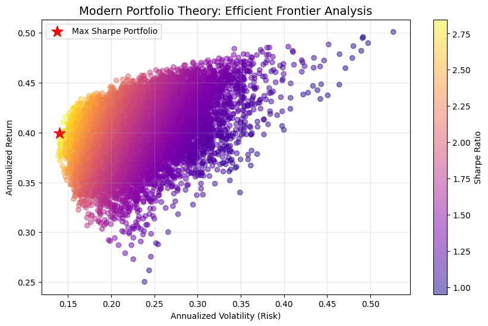

# Portfolio Optimization Engine
## Modern Portfolio Theory & Efficient Frontier Analysis

This project implements the **Markowitz Portfolio Theory** to determine the optimal risk-adjusted allocation for a multi-asset portfolio. It leverages quadratic optimization concepts to find the **Efficient Frontier**.

## Objective
To maximize the **Sharpe Ratio** by optimizing asset weights, balancing expected return against portfolio volatility (standard deviation).

## Mathematical Framework
- **Portfolio Return:** $E(R_p) = \sum w_i E(R_i)$
- **Portfolio Variance:** $\sigma_p^2 = w^T \Sigma w$ (where $\Sigma$ is the Covariance Matrix)
- **Optimization Goal:** Maximize $S = \frac{R_p - R_f}{\sigma_p}$

## Features
- **Covariance Matrix Analysis:** Computes asset correlations to minimize systemic risk.
- **Monte Carlo Simulation:** Generates 10,000+ random weight distributions to visualize the Efficient Frontier.
- **Dynamic Data:** Integrated with `yfinance` for real-time equity data.

## Tech Stack
- **Language:** Python
- **Math/Stats:** NumPy, Pandas, SciPy
- **Visualization:** Matplotlib
